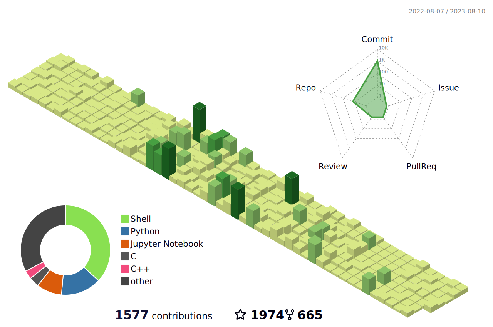
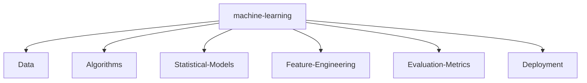

<!--   my-icons -->

    
    
    
    
    
       

<!--   my-header-img -->

<!--   my-ticker -->    

<!--   my-kaggle     
### My achievements on [kaggle](https://www.kaggle.com/andrej0marinchenko):

-->

<!--   my-skils -->

| Property                                        | Data                                                                                                                                                                                                                                                                                                                                                                                                                                                                                                                                                                                                                                                                                                                                                                                                                                                                                                                                                                                                                                                                                                                                                                                                                                                                                                                                                                                                                                                                                                                                                                                                                                                                                                                                                                                                            |
|-------------------------------------------------|-----------------------------------------------------------------------------------------------------------------------------------------------------------------------------------------------------------------------------------------------------------------------------------------------------------------------------------------------------------------------------------------------------------------------------------------------------------------------------------------------------------------------------------------------------------------------------------------------------------------------------------------------------------------------------------------------------------------------------------------------------------------------------------------------------------------------------------------------------------------------------------------------------------------------------------------------------------------------------------------------------------------------------------------------------------------------------------------------------------------------------------------------------------------------------------------------------------------------------------------------------------------------------------------------------------------------------------------------------------------------------------------------------------------------------------------------------------------------------------------------------------------------------------------------------------------------------------------------------------------------------------------------------------------------------------------------------------------------------------------------------------------------------------------------------------------|
| **Language**                              |                                                                                                                                                                                                                                                                                                                                                                                                                                                                                                                                                                                                                                                                                                                                                                                                                                                                                                                                                                                                                                                                                                                                                                                                                                                                                                                                                                                                                                                                                                       |
| **Domain Knownledge**                           |                                                                                                                                                                                                                                                                                                                                                                    |
| **Tools**                                     |                                                                                                                                                                                                                                                                                                                                                                                                                                                                                                                                                                                                                                                                                                                                                                                                                                                                                                                                                                                                                                         |
| **Databases**                                   |                                                                                                                                                                             |
| **OS**                                          |                                                                                                                                                                                                                                                                               |
| **IDE & Platform**                            |                                                                                                                                                                                                                                                                                                                                                                                                                                                                                                                                 |
| **Framework** |    |

<!--   GitHub stats graph -->
### 📈 GitHub Activity Graph:
<!--  -->

| .                                                                                                                                       | .                                                                                                                         |
|-----------------------------------------------------------------------------------------------------------------------------------------|---------------------------------------------------------------------------------------------------------------------------|
|  |  |

</img>

<!--   profile-green-animate 
-->

<!--   grid-snake 
-->

<!--   skyline 
-->

<!--  2d history skills 
</img>-->

Trophy: Github Profile Trophy

   <!--machine-learning-->

 

                      

 

#########################################Thanks for visiting :snowman: :snowman: :snowman:##################################

 

#########################################Thanks for visiting :snowman: :snowman: :snowman:##################################

counting of visitors to this page in this section started from August 11, 2023

<!--## Star History

-->

### Profile Views
counting of visitors to this page in this section started from August 11, 2023

 

