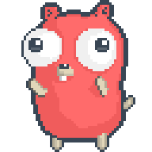
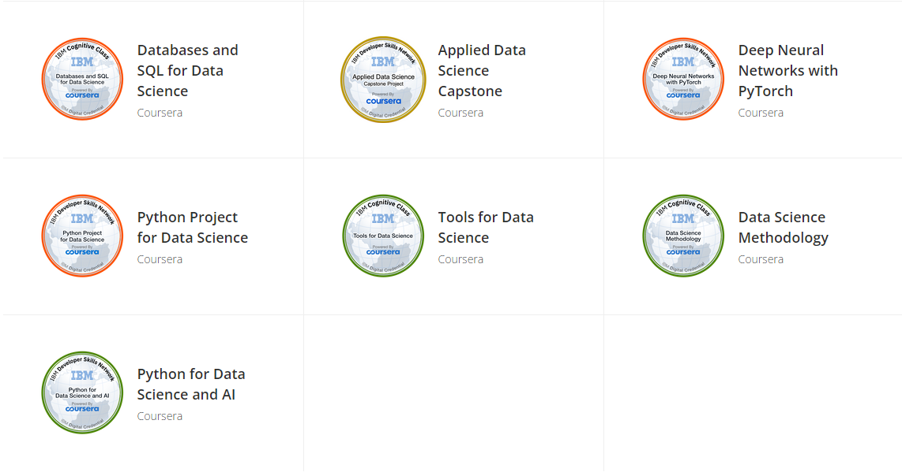

<!--   my-icons -->

    
    
    <!--  -->
    
    
    
       

<!--   my-header-img -->

  

  

  

<!--   my-skils -->

# 🧰My Skils

| Property              | Data                                                         |
| --------------------- | ------------------------------------------------------------ |
| **Language**          |       |
| **Domain Knownledge** |     |
| **Tools**             |   |
| **Databases**         |    |
| **OS**                |      |
| **IDE & Platform**    |      |
| **Framework**         |    |

<table>
  <tr>
    <td></td>
    <td></td>
    <td></td>
  </tr>
  <tr>
    <td></td>
    <td></td>
    <td></td>
  </tr>
  <tr>
    <td></td>
    <td></td>
    <td></td>
  </tr>
  <tr>
    <td></td>
    <td></td>
    <td></td>
  </tr>
  <tr>
    <td></td>
    <td></td>
    <td></td>
  </tr>
  <tr>
    <td></td>
    <td></td>
    <td></td>
  </tr>
</table>
<!--   GitHub stats graph -->

# 📈 GitHub Activity Graph
<!--  -->

| .                                                                                                                                       | .                                                                                                                         |
|-----------------------------------------------------------------------------------------------------------------------------------------|---------------------------------------------------------------------------------------------------------------------------|
|  |  |

</img>

<!--   profile-green-animate 
-->

<!--   grid-snake 
-->

<!--   skyline 
-->

<!--  2d history skills 
</img>-->

Trophy: Github Profile Trophy

   <!--machine-learning-->

 

# 💻Contributions calendar

<table >
  <tr>
    <td>💝恭喜您成为第</td>
    <td></td>
    <td>位访客，感谢您的关注和支持！💯</td>
  </tr>
</table>

counting of visitors to this page in this section started from August 11, 2023

<!--## Star History
-->

# 📝My Blog 

- 👋 Hi, My ID is 及辞，很高兴见到你

- 🧑‍💻 热爱自由，高效工作，言达其意，语及其辞
- 🌱 想更了解我？也许你可以到[这里](https://jici-zeroten.github.io/about/)看看
- 👋 My Blog：[https://jici-zeroten.github.io](https://jici-zeroten.github.io/)
- 🍪 会尝试上传一些有趣的内容到我的博客
- 💞️ 感谢GitHub、Gitee、GitCode等开源社区
- 📫 感谢一直陪伴着我的小伙伴和大师傅们

<!--  -->

# 🥇My Badges

# 🎧Some Music

# 🏊Profile Views

counting of visitors to this page in this section started from August 11, 2023

 

